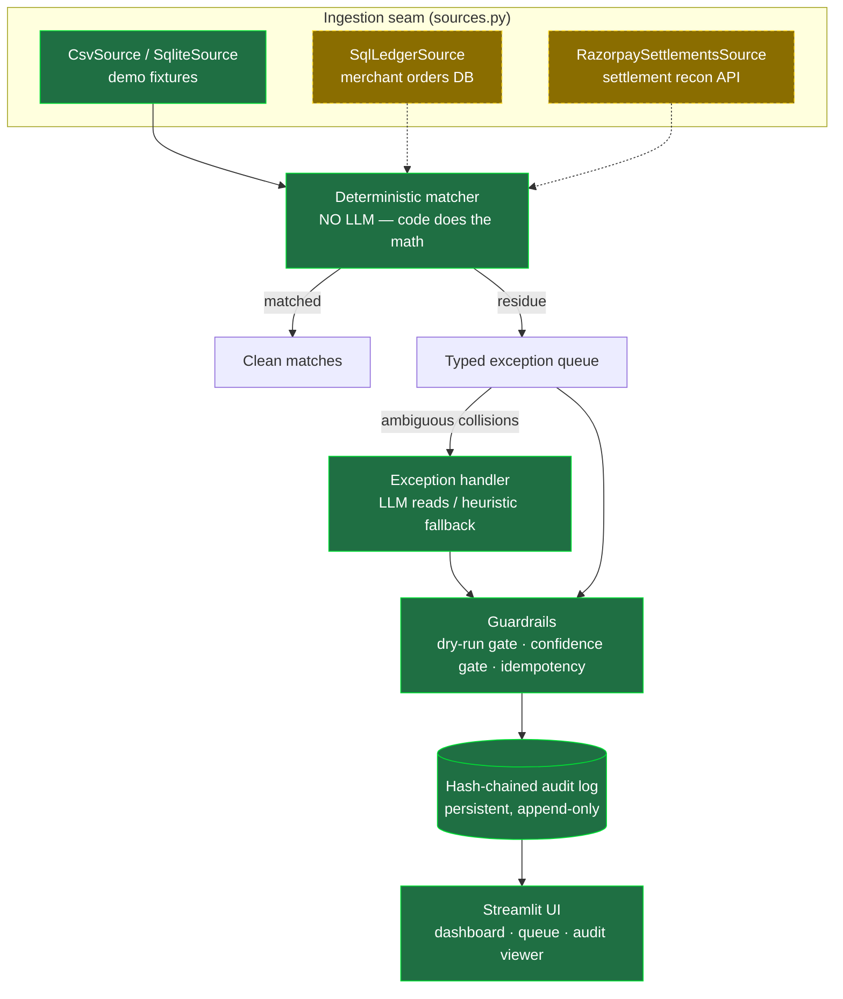

# Architecture & Production Readiness

> This document is deliberately honest about what is production-grade today and what a
> real deployment still needs. The system is a **production-grade reconciliation core**
> with a **costed path to full production** — not a finished distributed system. Claiming
> otherwise would be the kind of overclaim the rest of this project exists to avoid.

## 1. Components

Solid = built and tested. Dashed = documented production stubs (the seam where live
data plugs in). The matcher and everything downstream are source-agnostic, so swapping
the CSV fixture for a live DB + Razorpay API changes only which adapter is constructed.

## 2. Core principle

**The LLM reads; deterministic code does the math.** Every rupee figure — fee
decomposition, money-conservation checks, credit-to-order pairing amounts — is computed
in Python. The LLM is confined to interpreting one fuzzy, free-text signal (a noisy bank
narration) on the small escalated tail the rules refused to guess. An LLM must never
arithmetic a ledger.

## 3. Guardrails (all working code, all tested)

| Guardrail | Mechanism | Test |
|---|---|---|
| Tamper-evidence | SHA-256 hash-chained audit log; editing history breaks every later link | `test_audit.py` |
| Persistence | Audit log is append-only and survives across runs (run_id / cycle / ts per entry) | `test_pipeline.py` |
| Idempotency | An already-APPLIED decision re-runs as `SKIPPED_IDEMPOTENT`, never double-applied | `test_pipeline.py::test_reexecute_is_idempotent` |
| Bounded | Rules escalate genuine ambiguity; handler applies a confidence gate (≥0.75 auto, ≥0.45 flag) | `test_matcher.py`, `test_handler.py` |
| Gated | Dry-run by default; only high-confidence AUTO_RESOLVE applies, and only with `--execute` | `test_pipeline.py` |
| Injection posture | Untrusted bank narration is sanitized + JSON-encoded before the LLM; heuristic path is substring-only | `test_sanitize.py` |
| Resilience | `net.with_retries` bounded backoff on the real API-adapter path | `test_net.py` |

## 4. Current state vs production target

| Concern | Today (built & tested) | Production target | Gap size |
|---|---|---|---|
| Ingestion | CSV / SQLite adapters behind a `ReconciliationSource` interface | `RazorpaySettlementsSource` (recon API, paginated) + `SqlLedgerSource` (merchant DB) | **Small** — the interface exists; fill the two stubs |
| Storage | SQLite (real, queryable) + JSONL audit log | Postgres (connection-string swap) + audit log in an append-only table / WORM store | **Small–medium** |
| Runtime | CLI batch + Streamlit UI | Scheduled per-cycle batch job (Airflow/cron) + a thin API for on-demand | **Medium** |
| Scale | in-memory, 239 records in ~1 ms | bucketed + incremental for 10⁵–10⁶ lines/cycle (see §5) | **Medium** |
| LLM | keyless heuristic; real path wired but unvalidated | Anthropic with cost caps, rate limiting, in-region/redacted calls | **Medium** |
| Ops | JSON structured logs, Docker, retries | + metrics/tracing, alerting, healthchecks, dashboards | **Medium** |
| Multi-tenancy / auth | single merchant, no auth | per-merchant isolation, RBAC, SSO | **Large — out of scope** |

## 5. Scaling analysis (honest numbers)

- **Today:** 239 ledger + recon rows classified in **~1 ms** in memory. The reported
  `records/s` is *classification throughput only* — it excludes DB I/O and LLM latency,
  and it is not a claim about production volume.
- **Algorithmic shape:** the matcher builds dict indexes (`payment_id → recon rows`,
  `order_id → refunds`) and does O(1) lookups, so the structural passes are **O(n)**.
  The one quadratic risk is the fuzzy pairing pass — worst case
  O(unmatched × orphans). At scale, **bucket candidates by `(amount, settlement_date)`**
  so each unmatched order compares against a tiny bucket, keeping it near-linear.
- **At ~1 M settlement lines / month:**
  - *Matcher:* seconds, if bucketed and run incrementally per settlement cycle rather
    than reprocessing history (the same "as-of / no future leak" rule we already follow).
  - *Handler:* the LLM runs **only on the escalated tail** (a fraction of a percent),
    so cost/latency stay bounded by design — this is the whole point of rules-first.
  - *UI:* recompute-on-render (fine at 239 rows) does **not** scale — production
    precomputes per-cycle results into a `reconciliation_results` table and the UI reads
    them. Called out so the demo shortcut isn't mistaken for the production design.
  - *Bottleneck:* DB I/O + settlement-API pagination dominate, not the CPU work.

## 6. Failure modes & mitigations

| Failure | Mitigation | Status |
|---|---|---|
| Settlement API flakes / rate-limits | `net.with_retries` bounded exponential backoff; loud failure, never a silent empty list | Built |
| A settlement cycle is re-run | Idempotency: applied decisions are skipped, not re-applied | Built |
| Audit log tampering | Hash chain breaks; `verify()` detects it | Built |
| Genuine pairing ambiguity | Escalate, don't guess; human confirms FLAG cases | Built |
| Prompt injection via narration | Sanitize + JSON-encode untrusted text; heuristic path is injection-immune | Built |
| LLM outage / no key | Transparent heuristic fallback keeps the pipeline running | Built |
| Data corruption (money not conserved) | Money-conservation guard flags `credit ≠ amount − fee` as FEE_MISMATCH | Built |

## 7. Security & compliance (RBI-regulated context)

- **Data localization (RBI):** the merchant narration + customer names are payment data.
  Before any call to a foreign LLM API, a production deployment must **redact/tokenize
  the narration to the minimal derived signal** (or use an in-region model). The seam is
  explicit: `sanitize_narration()` is where redaction/tokenization would also live.
- **Prompt injection:** narration is untrusted; it is bounded, control-char-stripped, and
  passed as JSON-encoded *data*, never concatenated as instructions.
- **Secrets:** keys via env / `.env` (gitignored) today; a real deployment uses a secrets
  manager. The repo never commits keys and CI runs keyless.
- **PII:** synthetic names today; production needs field-level encryption + access logging.
- **RBI FREE-AI:** the hash-chained audit trail + human-in-the-loop gate map onto the
  Accountability and Understandable-by-Design sutras.

## 8. What we deliberately did NOT build (and why)

- **Kubernetes / message queues / microservice split** — over-engineering for a solo,
  single-merchant reconciler; half-built distributed infra reads as cargo-culting and is
  worse than an honest monolith with a clear scaling path.
- **Live settlement integration** — test-mode settlements are KYC-gated and never populate
  (verified day-1 spike, see [LOG.md](LOG.md)); it needs an activated account, not more code.
- **Postgres wiring / multi-tenant auth** — documented as the next step (compose has the
  commented service), not shipped half-done.
- **Live `razorpay-mcp-server` wiring** — deliberately researched then deferred (2026-08-28),
  not skipped out of oversight. It's genuinely the highest-signal, lowest-effort credibility
  move available *once unblocked*, but "unblocked" concretely means: (a) fresh `rzp_test_`
  keys generated from a Razorpay dashboard, and (b) either installing the Go toolchain or
  fetching a prebuilt release binary — neither of which was on this machine when checked.
  Real settlement data would still be KYC-gated regardless (§ live settlement integration,
  above), so wiring it would demonstrate real MCP tool-calling on the *payments* side (which
  the day-1 spike already proved works via raw API calls), not unblock new data. `sources.py`'s
  `RazorpaySettlementsSource` stub already documents the exact tool name
  (`fetch_settlement_recon_details`) it would call.

Deployment: `docker compose up` runs the UI; `docker run … python src/pipeline.py --execute
--cycle <id>` runs the batch job. CI builds the image and runs the idempotency re-check on
every push.
